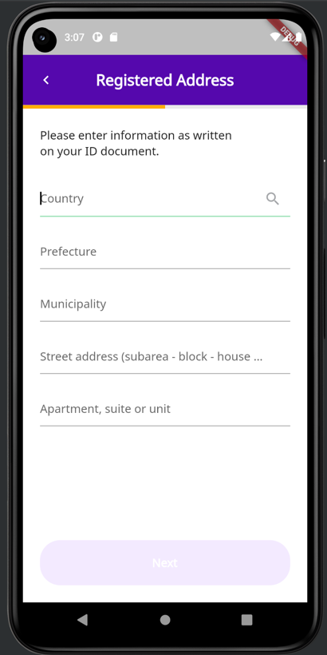

# 📱 Gigabank flutter assignment

This is the repository for the flutter coding assignment for [gigabank](https://gigabank.jp). On this assignment you'll be called to implement an address lookup form as in the following screenshot.  

Ideally, the assignment should NOT take more than 4 hours. Anything that you think can be left out, add a `//TODO` on the comments and say what you would have implemented, had you had the time. 

## ☑️ Acceptance criteria

- Implement the code in the address screen, in order to retrieve the user address
- Store user address in an object
- Follow the design of the screenshot  
- Implement validations for the fields e.g. for street address the `subarea-block-house` format is expected
- (optional, but we'll be impressed!) The country dropdown should show all the possible countries in the world with their flags and autocomplete the user's choice

## 📦 Deliverable

Once you finish the assignment, create a .zip file with the finalised code and send it to us via email. Add a NOTES.txt file in the zip with any notes that you might want to add. Feel free to add the `.git` folder, so we can check your commit history.

## 📙 Git Commit Message Guide

- `feat`: A new feature
- `fix`: A bug fix
- `docs`: Changes to documentation
- `style`: Formatting, missing semi colons, etc; no code change
- `refactor`: Refactoring production code
- `test`: Adding tests, refactoring test; no production code change
- `chore`: Updating build tasks, package manager configs, etc; no production code change

## 🔪  Feedback

We're not perfect and we know. Please let us know if we made any mistakes, typos or any feedback for this assignment, so we can improve. 
